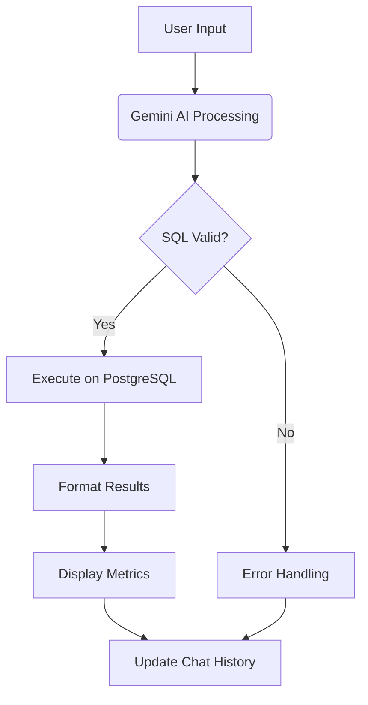

# PostgreSQL Chat Assistant with Gemini AI

A Streamlit-powered AI assistant that converts natural language queries into SQL using Google's Gemini AI, executes them on PostgreSQL databases, and displays results with rich visualizations and performance metrics.

## Features ✨

- **Natural Language to SQL**: Converts plain English questions to optimized SQL
- **Schema Analysis**: Auto-discovers tables, columns, and relationships
- **Vector-based Context**: Uses embeddings to find relevant tables for queries
- **Smart Formatting**: Automatically formats results (currency, dates, numbers)
- **Query Explanation**: Shows generated SQL with explanations
- **Performance Metrics**: Tracks processing time, complexity & rows returned
- **Conversation History**: Maintains context-aware chat history
- **DB Connection Management**: Secure URI-based PostgreSQL connections

## How It Works 🧠

1. **Connect to Database**: The app extracts schema and builds vector embeddings
2. **Ask Questions**: Natural language is processed through Gemini AI
3. **Execute SQL**: Generated SQL runs against your database
4. **Display Results**: View formatted data with metrics and explanations

## Workflow Diagram 🔄



## Installation 🛠️

### Clone Repository

```bash
git clone https://github.com/yourusername/postgres-chat-assistant.git
cd postgres-chat-assistant
```

### Install Dependencies

```bash
pip install -r requirements.txt
```

### Configure Environment

Create a `.env` file:

```
GEMINI_API_KEY="your_google_api_key"
```

## Configuration ⚙️

**Database Connection Format:**
```
postgresql://<user>:<password>@<host>:<port>/<database>
```

**Folder Structure:**
```
├── app.py                # Main Streamlit application
├── utils.py              # Core processing engine
├── csvs/                 # Auto-generated schema files
├── vectors/              # Vector embeddings for semantic search
├── requirements.txt      # Dependencies
└── .env                  # Configuration secrets
```

## Usage 🚀

### Start Application

```bash
streamlit run app.py
```

### Sample Queries:

```
"Show me all products in the Electronics category"
"What are the top 3 customers by total purchase amount?"
"How many sales were made in the North region last month?"
```

### Interface Guide:

- **Left Sidebar**: Database connection & metrics
- **Main Area**: Chat interface with query/results
- **Expandable Sections**: SQL code & performance metrics

## Query Processing Flow 🔍

1. **Schema Analysis**:
   - Extract tables/columns/relationships
   - Create vector embeddings for schema elements

2. **Query Processing**:
   - Use vector similarity to find relevant tables
   - Generate SQL through Gemini AI
   - Execute and format results

3. **Result Presentation**:
   - Interactive dataframes
   - Syntax-highlighted SQL
   - Performance metrics dashboard

## Tech Stack 🧩

| Component | Technology |
|-----------|-----------|
| Natural Language | Google Gemini AI |
| Database | PostgreSQL |
| UI Framework | Streamlit |
| Vector Store | ChromaDB |
| Data Processing | Pandas |
| Database Driver | psycopg2 |
| Environment | python-dotenv |

## Future Plans 🔮

- Visual query builder with diagram generation
- Voice interface for spoken queries
- Auto-generated dashboards from query results
- Query optimization suggestions
- Self-healing queries with auto-correction

